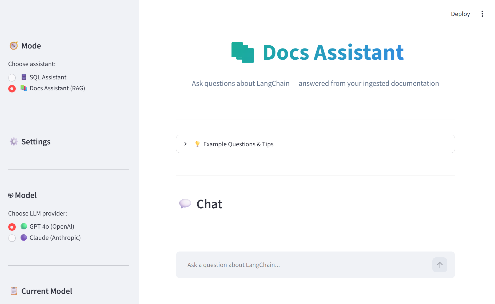
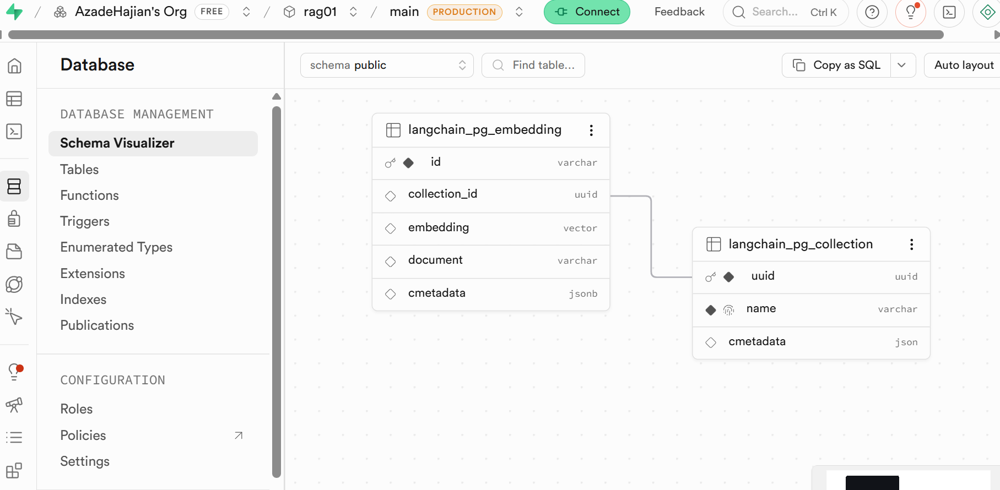

# AI Assistant Suite — SQL Assistant + Docs Assistant (RAG)

A Streamlit app with **two AI assistants** that share one codebase:

- **🗄️ SQL Assistant ("SQLSpeak")** — ask questions in plain English, the
  agent explores a Supabase/Postgres database and answers using SQL.
- **📚 Docs Assistant (RAG)** — ask questions about LangChain and get answers
  grounded in the actual LangChain documentation, retrieved from a vector
  database.

Both assistants are built with [LangGraph](https://langchain-ai.github.io/langgraph/)
`create_react_agent`, can use **OpenAI** or **Anthropic** as the chat model,
and are exposed both via the Streamlit UI and an MCP server.

This README focuses on the **Docs Assistant / RAG** part, since that's the
new piece — if you already understand RAG, skip to
[Project structure](#project-structure).

---

## Screenshots

**Docs Assistant (RAG) — Streamlit UI**, with the mode switch (SQL Assistant
/ Docs Assistant), LLM provider picker, and the chat interface:



**Vector database (Supabase pgvector)** — the `langchain_pg_embedding` /
`langchain_pg_collection` tables that [`rag/vectorstore.py`](rag/vectorstore.py)
creates automatically and [`rag/ingest.py`](rag/ingest.py) populates:



---

## What is RAG, and why do we need it?

Large language models (LLMs) like GPT-4o or Claude are trained on a snapshot
of the internet. They **don't know about**:

- documents that are private to you (your own docs, PDFs, notes...)
- anything that changed after their training cutoff
- niche, specific content like the exact API of a fast-moving library

**Retrieval-Augmented Generation (RAG)** fixes this by giving the model
"open-book" access to your own documents at answer time:

1. You ask a question.
2. The app **searches your documents** for the pieces most relevant to that
   question (this is "retrieval").
3. Those pieces are **inserted into the prompt** as context, right before
   the model generates its answer ("augmentation").
4. The model writes its answer using that context — instead of guessing
   from what it memorized during training ("generation").

In this project, "your documents" = the LangChain HTML documentation in
[`documents/latest/`](documents/latest/), and the "search" step is a
**vector similarity search** powered by **embeddings** and **pgvector**.

### Key concepts

| Concept | What it means here |
|---|---|
| **Embedding** | A piece of text turned into a list of numbers (a *vector*) that captures its meaning. Similar meanings → similar vectors. |
| **Vector database** | A database that stores these vectors and can quickly find the ones most similar to a query vector. Here: **Postgres + the `pgvector` extension, hosted on Supabase**. |
| **Chunking** | Splitting long documents into smaller pieces *before* embedding them, so retrieval can return focused, relevant snippets instead of whole pages. |
| **Collection** | A named group of embeddings inside the vector database (like a table). This project uses one collection: `langchain_docs`. |
| **Retrieval** | Turning the user's question into an embedding, then asking the vector database for the most similar chunks. |
| **Ingestion** | The one-time (or repeatable) process of: load documents → clean → chunk → embed → store in the vector database. You do this *before* you can ask questions about a given set of documents. |

### Why embeddings are always OpenAI

The Docs Assistant lets you pick **OpenAI or Anthropic** for the *chat* model
(the part that writes the final answer). But **embeddings always use OpenAI's
`text-embedding-3-small` model**, regardless of that choice — Anthropic does
not currently offer an embeddings API. This is handled automatically in
[`rag/embeddings.py`](rag/embeddings.py); you'll just need `OPENAI_API_KEY`
set even if you mainly use Claude for chat.

---

## The RAG pipeline, mapped to files

```
documents/latest/<folder>/*.html
        │
        ▼
┌─────────────────────┐
│ rag/loader.py        │  Reads each HTML file, strips Sphinx navigation/
│ load_html_folder()    │  scripts/styles, keeps the main content as text.
└─────────────────────┘  Each file becomes a LangChain `Document` with
        │                 metadata: source, title, category, file_name.
        ▼
┌─────────────────────┐
│ rag/splitter.py       │  Splits each Document into ~1000-character chunks
│ split_documents()      │  (150-char overlap) so retrieval returns focused
└─────────────────────┘  snippets instead of entire pages.
        │
        ▼
┌─────────────────────┐
│ rag/embeddings.py     │  Turns each chunk's text into a 1536-number vector
│ get_embeddings()       │  using OpenAI's text-embedding-3-small model.
└─────────────────────┘  ALWAYS OpenAI — see above.
        │
        ▼
┌─────────────────────┐
│ rag/vectorstore.py    │  Connects to the pgvector-enabled Postgres database
│ get_vectorstore()      │  on Supabase and stores (text + vector + metadata)
└─────────────────────┘  rows in the `langchain_docs` collection.
        │
        ▼
┌─────────────────────┐
│ rag/ingest.py         │  Wires the steps above together into one function,
│ ingest_path()          │  ingest_path("documents/latest/callbacks"), used by
└─────────────────────┘  both the CLI and the Streamlit "Knowledge Base" panel.


────────────────── at question time ──────────────────

User question (Streamlit chat)
        │
        ▼
┌─────────────────────┐
│ tools/rag_tools.py     │  retrieve_docs(query) embeds the question (OpenAI)
│ retrieve_docs()        │  and runs a similarity search against pgvector,
└─────────────────────┘  returning the top-k chunks with source + title.
        │
        ▼
┌─────────────────────┐
│ agent/rag_agent.py     │  A LangGraph react-agent (RAGAgent) whose only tool
│ RAGAgent                │  is retrieve_docs(). System prompt (rag_prompt.py)
└─────────────────────┘  tells it to always retrieve first, ground its
        │                 answer in the results, and cite sources.
        ▼
   Answer shown in the "📚 Docs Assistant" tab of main.py
```

---

## Project structure

```
ai_agent_rag/
├── main.py                  # Streamlit app — both assistants, mode switch in sidebar
├── requirements.txt
├── .env                      # your real secrets (gitignored)
├── .env.example              # template — copy to .env
│
├── agent/
│   ├── agent.py              # SQLAgent  (text-to-SQL, LangGraph react-agent)
│   ├── prompt.py             # SQL system prompt
│   ├── rag_agent.py           # RAGAgent  (Docs Assistant, LangGraph react-agent)
│   └── rag_prompt.py          # Docs Assistant system prompt
│
├── llm/
│   ├── base.py               # BaseLLM interface
│   ├── openai_client.py        # OpenAILLM  (chat model: gpt-4o)
│   └── anthropic_client.py      # AnthropicLLM (chat model: claude-sonnet-4.5)
│
├── rag/
│   ├── loader.py              # HTML -> cleaned LangChain Documents
│   ├── splitter.py            # Documents -> chunks
│   ├── embeddings.py           # OpenAI embeddings (always)
│   ├── vectorstore.py           # pgvector connection (Supabase)
│   └── ingest.py                # ingest_path(), CLI, KB-panel helpers
│
├── tools/
│   ├── supabase_tools.py        # SQL tools: list_tables, get_table_schema, ...
│   └── rag_tools.py              # retrieve_docs tool
│
├── mcp_server/
│   └── server.py                # FastMCP server exposing all tools via MCP
│
└── documents/latest/            # LangChain HTML docs (ingestion source)
    ├── callbacks/                # <- first folder ingested (4 files)
    ├── agents/
    ├── chains/
    └── ... (many more subfolders)
```

---

## Setup

### 1. Install dependencies

```bash
python -m venv .venv
source .venv/bin/activate        # Windows: .venv\Scripts\activate
pip install -r requirements.txt
```

### 2. Configure `.env`

Copy the template and fill in real values:

```bash
cp .env.example .env
```

You'll need:

- **`OPENAI_API_KEY`** — required for OpenAI chat **and** for embeddings
  (needed even if you plan to use Claude for chat).
- **`ANTHROPIC_API_KEY`** — required if you want to use Claude for chat.
- **Supabase project #1** (`SUPABASE_URL`, `SUPABASE_ANON_KEY`,
  `SUPABASE_PROJECT_ID`) — the database the **SQL Assistant** queries.
- **Supabase project #2** (`DATABASE_URL`) — a separate Supabase project with
  the **`pgvector`** extension, used as the vector database for the **Docs
  Assistant**. Use the Postgres *connection string* from
  *Project Settings → Database → Connection string (URI)*.
- RAG settings (`EMBEDDING_MODEL`, `RAG_COLLECTION_NAME`, `RAG_CHUNK_SIZE`,
  `RAG_CHUNK_OVERLAP`) — sensible defaults are already filled in.

`.env` is gitignored — never commit it. `.env.example` has the same keys with
placeholder values and is safe to commit.

### 3. pgvector setup

Nothing to do manually in most cases: the first time the app connects to the
vector database, [`rag/vectorstore.py`](rag/vectorstore.py) runs
`CREATE EXTENSION IF NOT EXISTS vector;` and auto-creates the
`langchain_pg_collection` / `langchain_pg_embedding` tables.

If that ever fails (e.g. due to permissions), run this once in the Supabase
SQL editor for project #2:

```sql
CREATE EXTENSION IF NOT EXISTS vector;
```

---

## Ingesting documents (populating the vector database)

Before the Docs Assistant can answer anything, you need to **ingest** at
least one folder from `documents/latest/`. To keep things fast for a first
run, start with `callbacks/` (4 files).

### Option A — command line

```bash
python -m rag.ingest documents/latest/callbacks
```

Output looks like:

```
Loaded 4 file(s)
Created 87 chunk(s)
Inserted 87 chunk(s) into the vector store
```

You can re-run this for any other subfolder later, e.g.:

```bash
python -m rag.ingest documents/latest/agents
```

### Option B — Streamlit "Knowledge Base" panel

1. Run the app (`streamlit run main.py`).
2. Switch to **📚 Docs Assistant (RAG)** in the sidebar.
3. In the **Knowledge Base** section, pick a folder from the dropdown
   (any subfolder of `documents/latest/`) and click **📥 Ingest selected
   folder**.
4. The "Ingested chunks" counter updates once it's done.

Both options call the same underlying function
(`rag.ingest.ingest_path`), so the result is identical.

---

## Running the app

```bash
streamlit run main.py
```

The sidebar has a **🧭 Mode** switch:

- **🗄️ SQL Assistant** — the original SQLSpeak experience, unchanged.
- **📚 Docs Assistant (RAG)** — the new RAG-powered LangChain docs assistant.

Each mode has its own:
- chat history
- LLM provider choice (OpenAI / Anthropic)
- query counter / statistics

so switching modes doesn't lose your place in either conversation.

---

## Using the Docs Assistant

1. Make sure you've ingested at least one folder (see above) — the sidebar
   shows **"Ingested chunks"** so you can confirm.
2. Ask a question, e.g.:
   - *"What does AsyncIteratorCallbackHandler do?"*
   - *"How do I log callbacks with LoggingCallbackHandler?"*
   - *"What is the purpose of a callback handler in LangChain?"*
3. The agent will:
   - call `retrieve_docs()` to search the vector database
   - read the returned chunks
   - answer using that content, citing the source file(s), e.g.
     `(Source: callbacks/langchain.callbacks.streaming_aiter.AsyncIteratorCallbackHandler.html)`

**If the knowledge base doesn't have the answer:** the agent will say so
honestly instead of guessing, and suggest ingesting the relevant
`documents/latest/<folder>` via the Knowledge Base panel.

**Switching providers:** choosing "Claude (Anthropic)" in Docs mode changes
who *writes the answer* — retrieval/embeddings still always use OpenAI.

---

## Using the SQL Assistant

Unchanged from before: ask natural-language questions about the database in
Supabase project #1, and the agent will explore tables/schemas and run SQL to
answer. See the in-app "💡 Example Questions & Tips" expander for ideas.

---

## MCP server

[`mcp_server/server.py`](mcp_server/server.py) exposes the same tools used by
both agents over the [Model Context Protocol](https://modelcontextprotocol.io/),
so any MCP-compatible client (e.g. Claude Desktop) can use them directly:

- `list_all_tables`, `get_schema`, `sample_rows`, `run_sql` — SQL tools
- `retrieve_documentation` — searches the same pgvector knowledge base used
  by the Docs Assistant

Run it with:

```bash
python -m mcp_server.server
```

---

## Troubleshooting

- **"OPENAI_API_KEY not found in .env"** when using the Docs Assistant, even
  with `LLM_PROVIDER`/provider set to Anthropic — embeddings always need
  `OPENAI_API_KEY`. Add it to `.env`.
- **"Ingested chunks: 0"** — you haven't ingested anything yet. Run
  `python -m rag.ingest documents/latest/callbacks` or use the Knowledge Base
  panel.
- **pgvector / connection errors** — double check `DATABASE_URL` in `.env`
  points at the **second** Supabase project (the one with pgvector), and uses
  the full connection string from *Project Settings → Database*.
- **Answers seem generic / not grounded** — make sure you've ingested the
  folder that actually covers your question's topic; the agent can only cite
  what's been ingested.

---

## Future ideas

- Ingest the rest of `documents/latest/` (agents, chains, chat_models, etc.)
- Add a "delete collection / re-ingest" option to the Knowledge Base panel
- Hybrid search (keyword + vector) or re-ranking for better retrieval quality
- Show retrieved chunks in the UI (not just the final answer) for transparency
